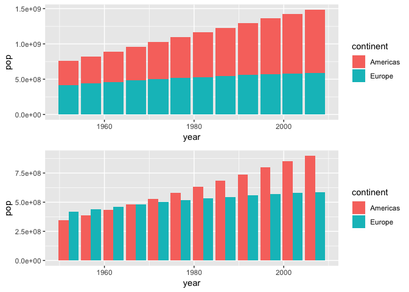
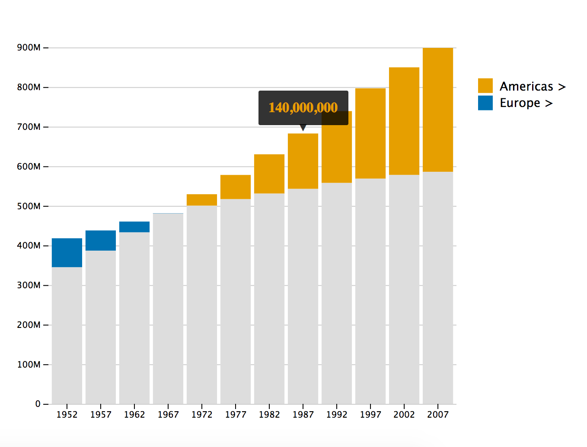
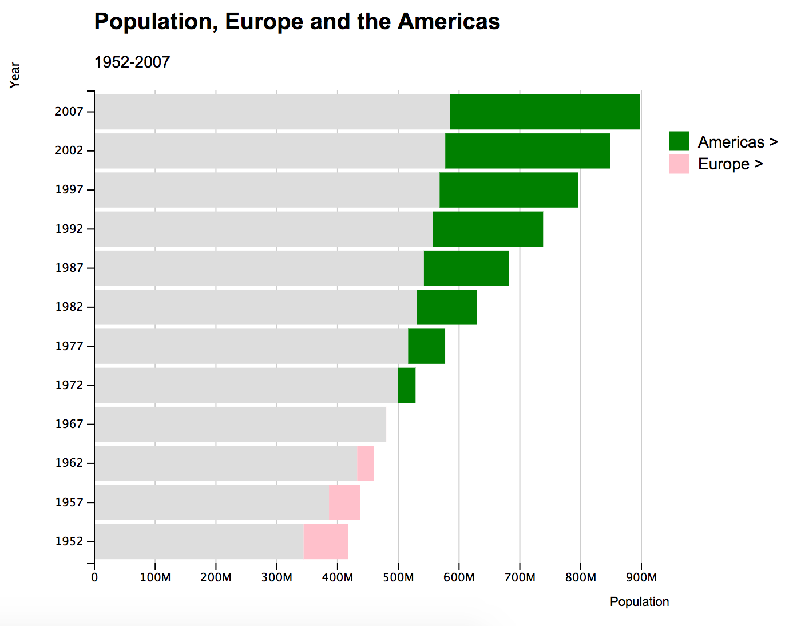

<!-- README.md is generated from README.Rmd. Please edit that file -->

```{r, echo = FALSE}
knitr::opts_chunk$set(
  collapse = TRUE,
  comment = "#>",
  fig.path = "README-"
)
```

# compareBars

[](https://travis-ci.org/daranzolin/compareBars)

>"Less is more." 

>"Simplify simplify." 


The goal of `compareBars` is to reduce the clutter of comparative bar charts.

## Installation

You can install compareBars from github with:

```{r gh-installation, eval = FALSE}
# install.packages("devtools")
devtools::install_github("daranzolin/compareBars")
```

## A simpler alternative

Consider the following bar charts:

```{r warning=FALSE, message=FALSE, eval=FALSE}
library(tidyverse)
library(gapminder)
library(patchwork)

d <- gapminder %>% 
  filter(continent %in% c("Americas", "Europe")) %>% 
  group_by(continent, year) %>% 
  summarize(pop = sum(pop))

p1 <- ggplot(d, aes(year, pop, fill = continent)) + geom_col()
p2 <- ggplot(d, aes(year, pop, fill = continent)) + geom_col(position = "dodge")

p1 + p2 + plot_layout(ncol = 1)
```



When did the total population of the Americas exceed the total population of Europe? With the top chart, you'd have to guess sometime between 1960 and 1980, but it's hard to tell at a glance. And while it's easier to tell with the second plot, the clarity comes at the sake of clutter. 

`compareBars` offers a simpler, cleaner alternative with d3.js: 

```{r eval=FALSE}
library(compareBars)
d %>% 
  spread(continent, pop) %>% 
  mutate(year = factor(year)) %>% 
  compareBars(year, Americas, Europe)
```



Not only is the moment when the Americas' population exceeded Europe's immediately clear, but you also get a much better sense of the magnitude by year. Approximating this kind of chart with ggplot requires a great deal of reshaping and wizardry.

An interactive tooltip shows the magnitude of difference between the two levels.

## Other options

You can adjust the chart by adding axis labels, titles, subtitles, specifying your own fill colors, changing the label fonts, and even the bar orientation:

```{r eval=FALSE}
d %>% 
  spread(continent, pop) %>% 
  mutate(year = factor(year)) %>% 
  compareBars(year, 
              Americas, 
              Europe,
              xLabel = "Population",
              yLabel = "Year",
              titleLabel = "Population, Europe and the Americas",
              subtitleLabel = "1952-2007",
              fontFamily = "Arial",
              compareVarFill1 = "pink",
              compareVarFill2 = "green",
              orientation = "horizontal")
```



Note that you must reshape your data into a 'non-tidy' form.
