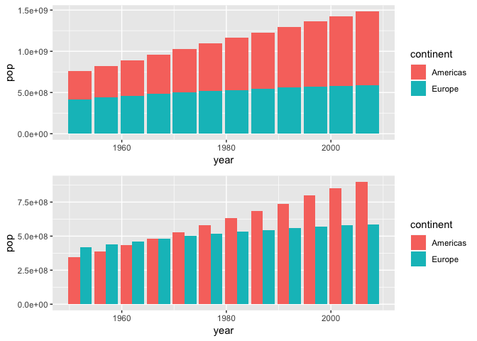
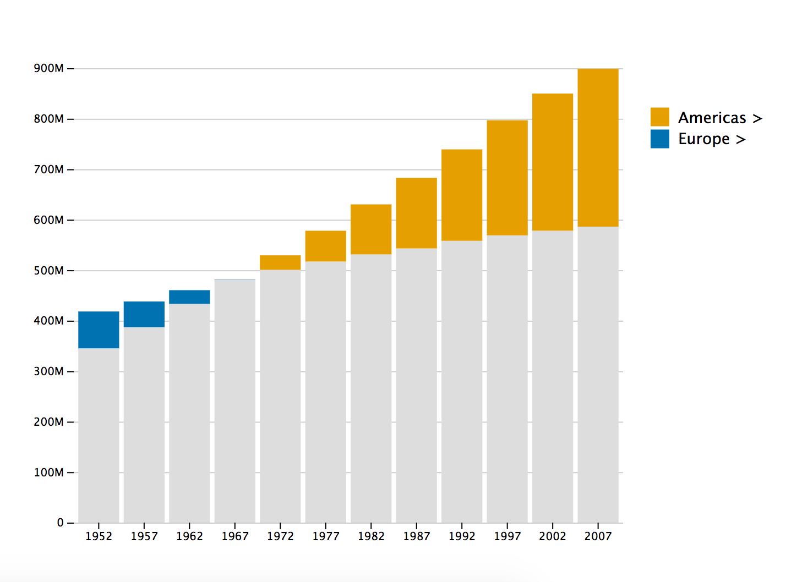
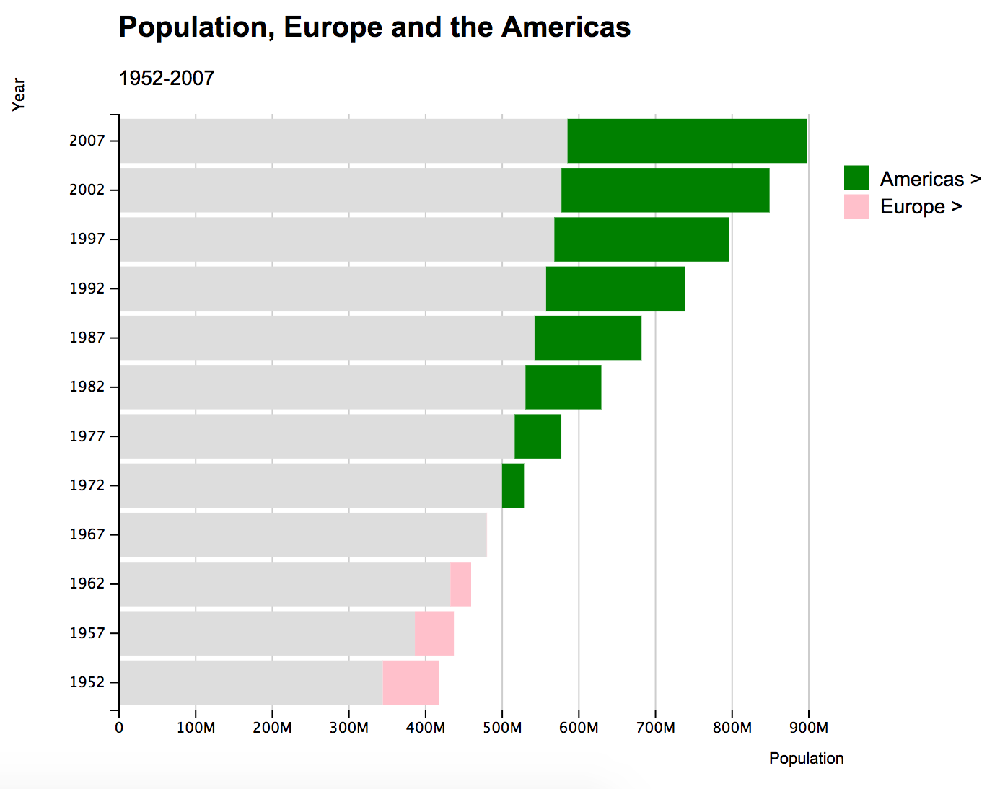

<!-- README.md is generated from README.Rmd. Please edit that file -->

# compareBars

> “Less is more.”

> “Simplify simplify.”

The goal of `compareBars` is to reduce the clutter of comparative bar
charts.

## Installation

You can install compareBars from github with:

``` r
# install.packages("devtools")
devtools::install_github("daranzolin/compareBars")
```

## A simpler alternative

Consider the following bar charts:

``` r
library(tidyverse)
library(gapminder)
library(patchwork)

d <- gapminder %>% 
  filter(continent %in% c("Americas", "Europe")) %>% 
  group_by(continent, year) %>% 
  summarize(pop = sum(pop))

p1 <- ggplot(d, aes(year, pop, fill = continent)) + geom_col()
p2 <- ggplot(d, aes(year, pop, fill = continent)) + geom_col(position = "dodge")

p1 + p2 + plot_layout(ncol = 1)
```

<!-- -->

When did the total population of the Americas exceed the total
population of Europe? With the top chart, you’d have to guess sometime
between 1960 and 1980, but it’s hard to tell at a glance. And while it’s
easier to tell with the second plot, the clarity comes at the sake of
clutter.

`compareBars` offers a simpler, cleaner alternative with d3.js:

``` r
library(compareBars)
d %>% 
  spread(continent, pop) %>% 
  mutate(year = factor(year)) %>% 
  compareBars(year, Americas, Europe)
```



Not only is the moment when the Americas’ population exceeded Europe’s
immediately clear, but you also get a much better sense of the magnitude
by year.

## Other options

You can adjust the chart by adding axis labels, titles, subtitles,
specifying your own fill colors, changing the label fonts, and even the
bar orientation:

``` r
d %>% 
  spread(continent, pop) %>% 
  mutate(year = factor(year)) %>% 
  compareBars(year, 
              Americas, 
              Europe,
              xLabel = "Population",
              yLabel = "Year",
              titleLabel = "Population, Europe and the Americas",
              subtitleLabel = "1952-2007",
              fontFamily = "Arial",
              compareVarFill1 = "pink",
              compareVarFill2 = "green",
              orientation = "horizontal")
```



## Special Thanks

Special thanks of course to Mike Bostock, the creator of d3.js and whose
blocks inspired the creation of `compareBars`. Thanks also to John Lewis
who first helped try to puzzle through a ggplot alternative.

## Known Issues

  - Resizing. I can’t figure it out.
  - Interactivity? Maybe a tooltip revealing the maximum value.
